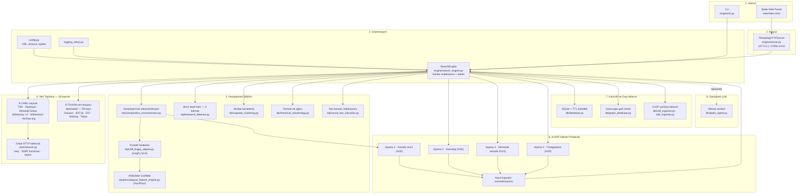
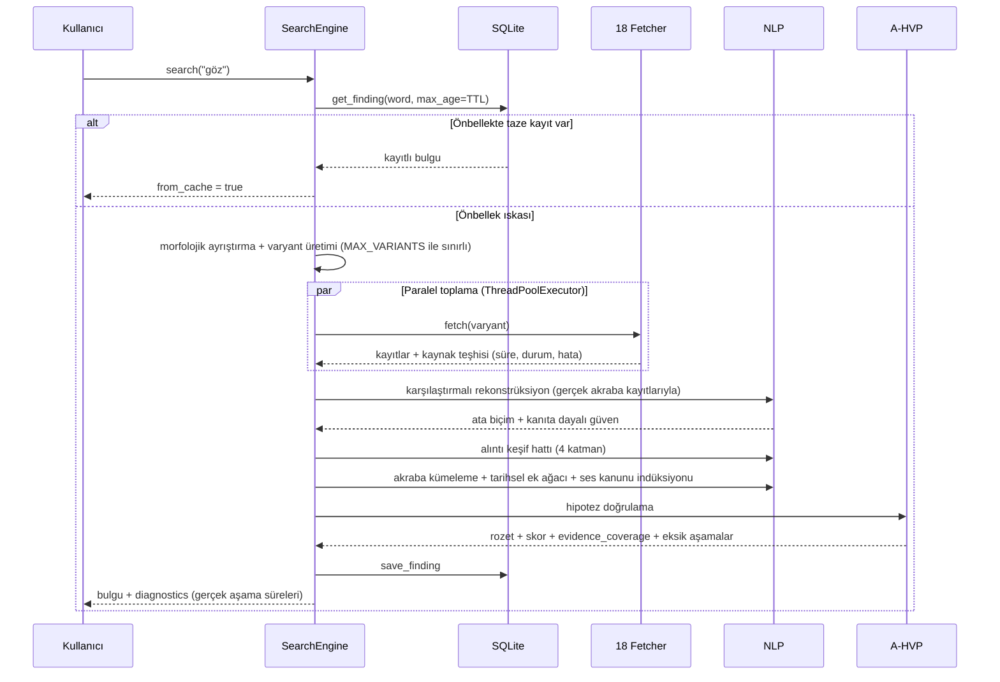
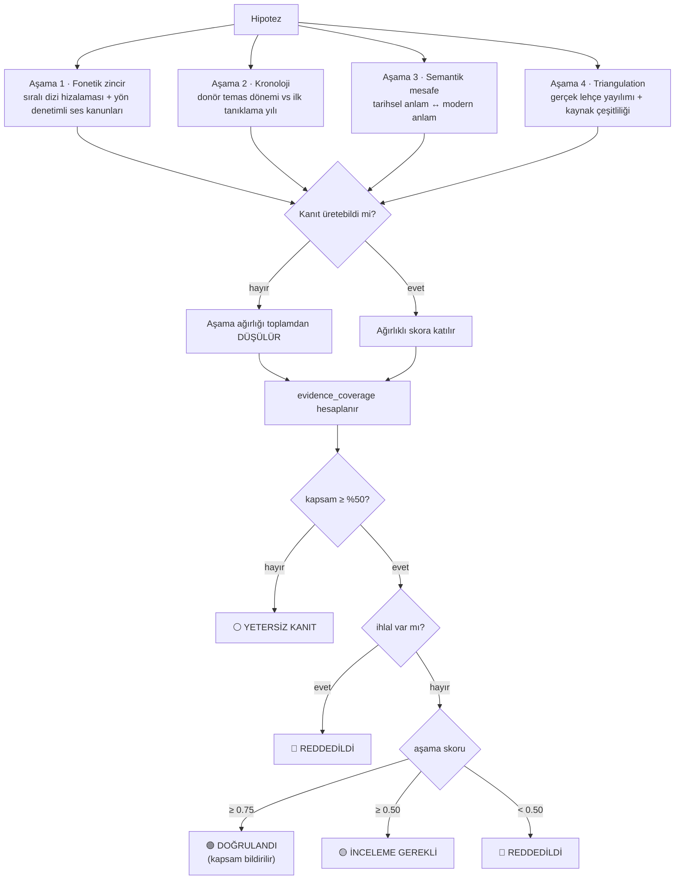

# Mimari

Bu belge motorun katmanlarını, veri akışını ve hakem protokolünü açıklar.
İddialar koddan doğrulanabilir; doğrulanamayan hiçbir teknoloji burada
listelenmez.

## Genel bakış



## Katmanlar

| Katman | Dosya | Sorumluluk |
|---|---|---|
| Yapılandırma | `engine/config.py` | Tüm URL, timeout, port, model adı, eşik ve ağırlıklar. `ETY_*` ortam değişkenleriyle ezilebilir. |
| Loglama | `engine/logging_setup.py` | Merkezî logger; her yutulan hata görünür olur. |
| Orkestrasyon | `engine/search_engine.py` | Fetcher paralelleştirme, teşhis toplama, NLP zinciri, önbellek. Fetcher listesi enjekte edilebilir (`fetchers=`). |
| HTTP | `engine/utils/network.py` | Tek HTTP kapısı: retry/backoff, tek User-Agent, SSRF koruması, charset sezimi, istek bazlı teşhis. |
| Veri toplama | `engine/fetchers/` | 18 toplayıcı + `BaseFetcher` sözleşmesi. Sözleşme: `fetch()` asla istisna fırlatmaz. |
| Dilbilim | `engine/nlp/` | Rekonstrüksiyon, hizalama, kümeleme, alıntı keşfi, A-HVP. |
| Ortak kurallar | `engine/utils/phonotactics.py`, `orthography.py` | Fonotaktik kısıtlar, ünlü uyumu, alıntı dil kalıpları, Türki Kiril karakter sınıfı. |
| Kalıcılık | `engine/db/` | SQLite (TTL önbellekli), Cytoscape graf, CLDF içe/dışa aktarım. |
| LLM | `engine/llm/` | Ollama sentezi. Kazınmış içerik `<untrusted_source>` sınırlayıcılarıyla verilir. |

## Veri akışı



## Karşılaştırmalı rekonstrüksiyon

Ata biçim, akraba biçimlerin hizalanmasıyla **konum duyarlı denklik
kümelerinden** türetilir:

| Konum | Denklik | Ata ses | Örnek |
|---|---|---|---|
| söz başı | `d ~ t` | `*t-` | deniz ~ теңіз → `*teŋiŕ` |
| söz başı | `g ~ k` | `*k-` | göz ~ көз → `*köŕ` |
| söz başı | `y ~ c ~ j ~ ç` | `*j-` | yol ~ жол ~ ҫул → `*jol` |
| söz sonu | `z ~ r` | `*-ŕ` | Lir-Şaz rotasizmi |
| söz sonu | `ş ~ l` | `*-ĺ` | lambdaizm |
| her yer | `n ~ ŋ` | `*-ŋ-` | deniz ~ teŋiz |

Güven skoru üç bileşenden hesaplanır:

```
güven = 0.40 × (tanık sayısı / 6)      # kaç bağımsız dil
      + 0.30 × (kol sayısı / 4)        # Oğuz, Kıpçak, Karluk, Sibirya, Oğur
      + 0.30 × sütun uyumu             # hizalama sütunlarında tanıkların uzlaşması
```

En az **iki bağımsız dil tanığı** yoksa ata biçim üretilmez.

## A-HVP hakem protokolü



**Skor formülü**

```
aşama_skoru = Σ(ağırlık_i × skor_i) / Σ(ağırlık_i)      # yalnızca kanıtlı aşamalar
kapsam      = Σ(ağırlık_i) / Σ(tüm ağırlıklar)
yayımlanan  = aşama_skoru × kapsam
```

`aşama_skoru` ölçülebilen kanıtın **kalitesini**, `kapsam` ne kadarının
ölçülebildiğini bildirir. Rozet kararı `aşama_skoru` üzerinden verilir;
`kapsam` bir kapı görevi görür. Böylece "kanıt eksik" ile "kanıt kötü"
birbirine karışmaz.

## Alıntı keşif hattı

`nlp/loanword_detector.py` dört katmanı uygular:

1. **Fonotaktik ihlal analizi** — söz başı ünsüz kısıtı, ünsüz kümesi, ünlü
   uyumu (bileşikler istisna), Arapça vezin, Farsça/Batı ekleri
2. **Çapraz lehçe yayılımı** — gerçek `lang_code` sayımı / 25 dil
3. **Olasılık dağılımı** — öz Türkçelik ile donör atfı ayrı hesaplanır
4. **Donör en-yakın-komşu** — IPA Levenshtein ≤ 2

Katman 4 doğrudan eşleşme bulursa sınıflandırma ona uyar: sözlük kanıtı
kural tabanlı tahmini ezer.

## Graf şeması

`db/graph_database.py` Neo4j şemasına uygun düğüm/kenar üretir ve Cytoscape.js
JSON'u olarak dışa verir. **Neo4j sürücüsü kullanılmaz; canlı bir graf
veritabanı bağlantısı yoktur.**

| Düğüm | Alanlar |
|---|---|
| `WordForm` | word, lang, script |
| `ProtoRoot` | word, lang |
| `EtymologyCase` | hypothesis_type, confidence_score *(kanıt yoksa `null`)* |
| `Attestation` | kaynak, yıl |

| Kenar | Anlam |
|---|---|
| `DERIVED_FROM` | ata kök → modern biçim |
| `HAS_HYPOTHESIS` | kelime → etimoloji vakası |
| `ATTESTED_IN` | kelime → tarihsel tanıklama |
| `COGNATE_OF` | ata kök → akraba biçim |

Düğüm kimlikleri sanitize edilir; boşluk veya özel karakter içeren kelimeler
bozuk seçici üretmez.

## Güvenlik

| Yüzey | Önlem |
|---|---|
| Sunucu bağlanma | Varsayılan `127.0.0.1`; yerel olmayan adres uyarı loglar |
| CORS | Yapılandırılmış origin listesi; `*` varsayılan değil |
| Hata sızıntısı | İç istisna metni istemciye gitmez (`ETY_API_DEBUG_ERRORS` ile açılır) |
| Girdi | `MAX_QUERY_LENGTH` sınırı, amplifikasyon için `MAX_VARIANTS` |
| SSRF | `utils/network.py` özel/loopback/link-local adresleri ve `http(s)` dışı şemaları reddeder; kazıyıcılar alan adı beyaz listesi kullanır |
| Prompt injection | Kazınmış içerik `<untrusted_source>` içinde, uzunluğu sınırlı, sınırlayıcı etiketler kaçırılır |
| Web paneli XSS | Tüm dinamik içerik HTML kaçışından geçer; CDN betiklerinde SRI |

## Test mimarisi

```
engine/tests/
  conftest.py          soket düzeyinde ağ yalıtımı, geçici DB, tohum izolasyonu
  fakes.py             BaseFetcher test ikizleri (Fake/Failing/Empty/Slow)
  fixtures/http/       canlı kaynaklardan kaydedilmiş gerçek yanıtlar
  test_*.py            323 ağsız test
  live/                9 canlı kaynak testi (ETY_LIVE=1)
```

Testler soket düzeyinde ağdan yalıtılır: yanlışlıkla canlı ağa çıkan bir test
açık bir hata alır. `responses` ile mock'lanan istekler soket açmadığı için geçer.

## Bilinçli kapsam dışı bırakılanlar

| Konu | Gerekçe |
|---|---|
| Eğitilmiş ML alıntı sınıflandırıcı | Etiketli Türkçe veri kümesi yok; WOLD ingest'i önce tamamlanmalı |
| FastText semantik benzerlik | `gensim`'in Python 3.14 tekerleği yok |
| Neo4j canlı bağlantı | Yerel araç için gereksiz karmaşıklık; şema uyumu korunuyor |
| Next.js web uygulaması | Tek dosyalık statik panel yeterli |
| loanpy, Zemberek, Starlang KeNet | Değerlendirildi, ertelendi |
